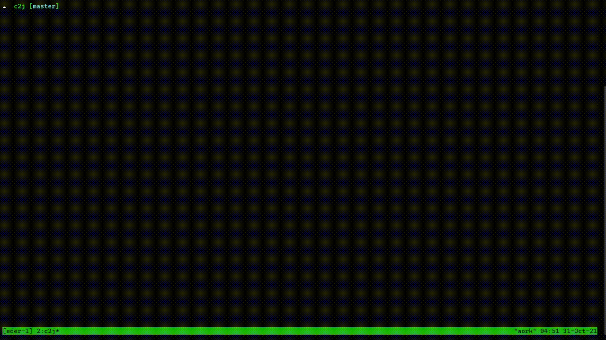

# C2J

[](https://github.com/edermanoel94/c2j/actions/workflows/go.yml)

A simple command line for convert **csv** into an array of **json**

## Install

### Building from Source

With Go 1.17 or higher:

```
go install github.com/edermanoel94/c2j
```

### Usage

#### Convert

To convert, run the `c2j` command to read from **stdin**, using standard delimiter, which is *comma*.

```
$ cat example_comma.csv | c2j
```

#### Convert with custom delimiter

Use the `--delimiter` or `-d` flag to specify a delimiter.

```
$ cat example_semicolon.csv | c2j --delimiter ";"
```

#### Demo



## Todo


- [ ] Use a path argument to convert

## Contributing

Pull requests for new features, bug fixes, and suggestions are welcome!

## License

[MIT](https://github.com/edermanoel94/c2j/blob/master/LICENSE)
